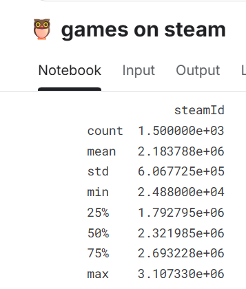
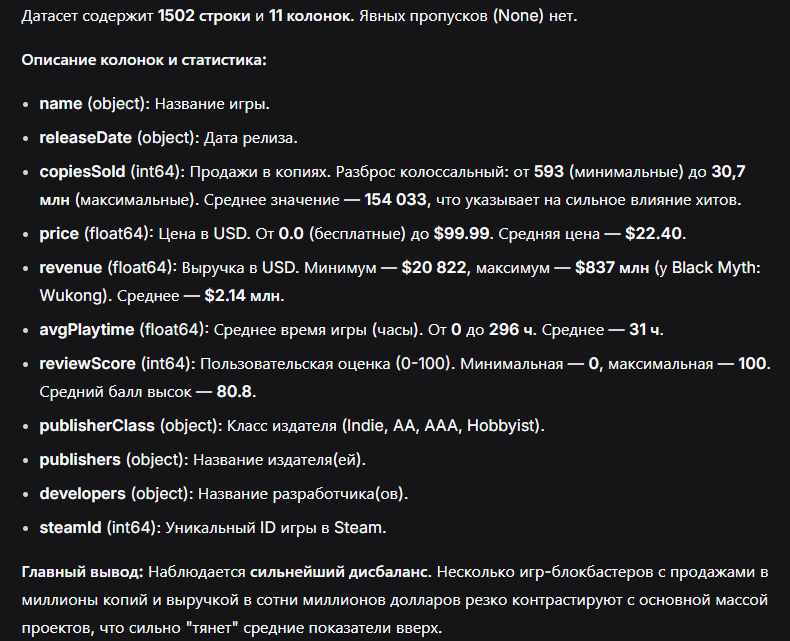
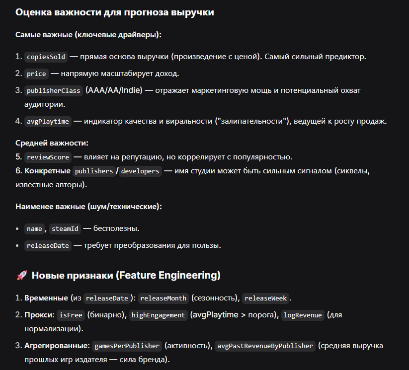
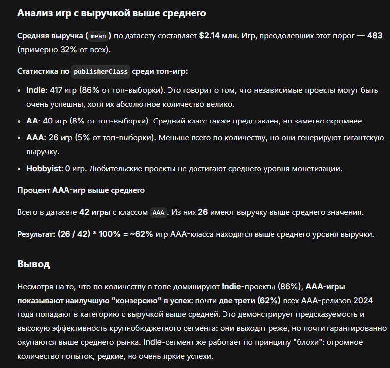
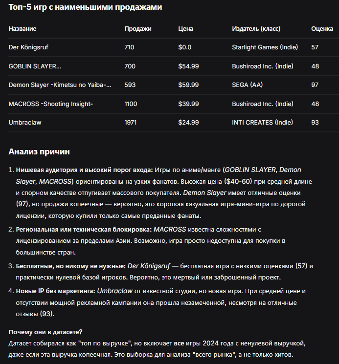
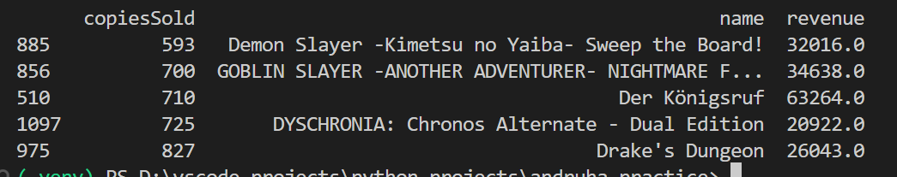
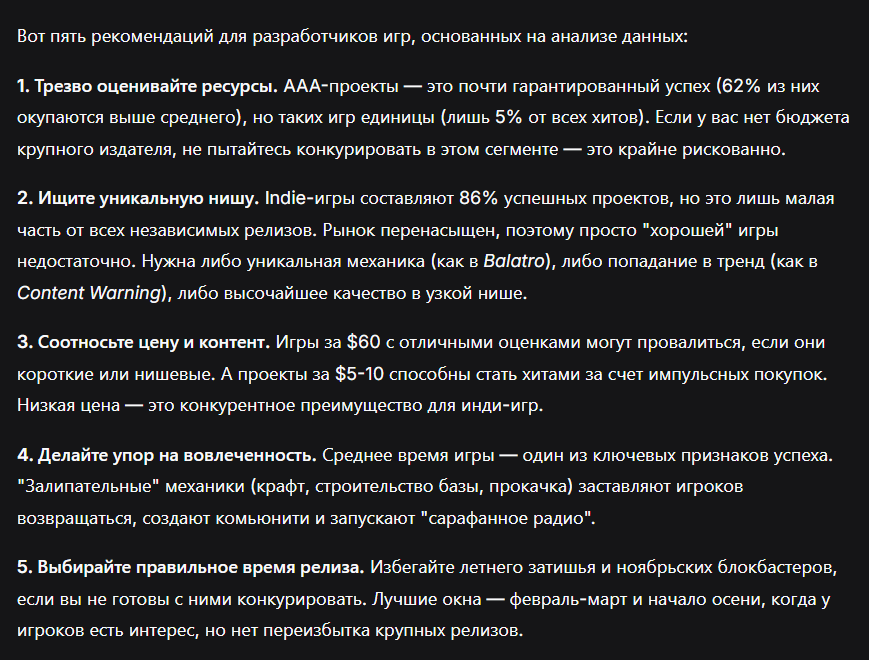

## Датасет
# Название
Top 1500 Games on Steam by Revenue 2024 (https://www.kaggle.com/code/debs2x/games-on-steam/input)

# Описание
Датасет включает информацию о 1500 самых прибыльных играх, выпущенных на Steam с 1 января по 9 сентября 2024 года. Данные собраны из различных источников и объединены в один удобный для анализа набор данных. Идея проекта заключается в предоставлении полезной информации для разработчиков игр, аналитиков и исследователей, которые могут использовать этот датасет для понимания рыночных трендов, ценовых стратегий и факторов, влияющих на вовлечённость игроков. 
(https://github.com/S2xc/games-on-steam/blob/main/README.md#-%D0%BE%D0%BF%D0%B8%D1%81%D0%B0%D0%BD%D0%B8%D0%B5-%D0%BF%D1%80%D0%BE%D0%B5%D0%BA%D1%82%D0%B0)
# Структура 
Датасет состоит из колонок: 
- name: Название игры
- releaseDate: Дата релиза
- publisher: Издатель
- developer: Разработчик
- price: Цена (в долларах США)
- copiesSold: Проданные копии
- revenue: Доход (в долларах США)
- avgPlaytime: Среднее время игры (в часах)
- reviewScore: Оценка пользователей
## Промпты
Здесь и далее для анализа используется нейросеть Deepseek, в силу ее многословности, приходилось в промпте задавать рамки для ответа, иначе он всегда оказывался слишком большим. 
# Промпт 1 
# Текст 
проведи первичный анализ датасета - покажи размер датасета (кол-во строк, кол-во колонок), для каждой колонки опиши, какие данные она показывает в контексте датасета, какой тип данных содержится в этой колонке, сколько в этой колонке пропусков, покажи их основные характеристики, такие как - наибольшее, наименьшее, среднее (mean)

ответ заключи в 200 слов, старайся уменьшить его
# Ответ LLM: 

# Вывод 
Модель хорошо определила структуру датасета, сделала небольшие выводы, однако, как мне кажется, подметила немного не те моменты. модель указала минимальное значения в price - 0, однако не указала, что для таких игр данные по revenue генерируются из внутриигровых покупок. В оценке 0 у игр модель так же не заметила проблем, хотя это может указывать на некорректность этой оценки и может повлиять на общую картину. 

# Промпт 2
# Текст
Оцени параметры по важности для модели прогнозирования выручки игры, отметь самые важные и неважные, предложи новые признаки, которые можно построить на основе этого датасета и которые будут вносить в модель ясность

старайся ответ уменьшить
# Ответ LLM: 

# Вывод 
Модель правильно определила важность большинства признаков, хорошо ввела новые параметры, однако в силу своей многословности ввела их слишком много, и даже ввела агрегированные параметры, что выглядит хорошо для анализа данных, но не для заточки модели под конкретную задачу. Считаю, что, например, к параметру isFree, нужно вводить параметр, который будет показывать, условно ли бесплатна игра или нет (т.е. есть ли в ней платные элементы), но модель просто предложила данный параметр, не объяснив этого нюанса. Подмечу, что тут так же пытался ограничить ответ модели, однако в этот раз без жестких ограничений, и так видно, что ллм говорит много, если ее не ограничить кол-вом слов 

# Промпт 3
# Текст
Проанализируй все игры, выручка которых составила > mean значения для этой колонки. Выведи статистику по publisherClass, выведи, какой процент AAA игр по выручке находится выше, чем mean значение. Проанализируй, напиши результат. 

ответ составь менее, чем за 300 слов.
# Ответ LLM: 

# Вывод:
ЛЛМ провела анализ среди publisherClass, посмотрела AAA игры, однако анализ AAA игр провела неполный. Так, модель указывает на НАИЛУЧШУЮ "конверсию" в успех среди всех игр, однако делает поспешные выводы, не узнав "конверсию" остальных игр. таким образом, вывод ооснован на неполных данных, что может впоследствии сказаться.

# Промпт 4 
# Текст 
Выбери топ5 игр с наименьшим количество проданных копий. проанализируй, почему у них может быть небольшое количество проданных копий и почему они могут быть в этом датасете.
 
# Ответ LLM: 

# Вывод: 
Вывод модели довольно хороший, неплохо проанализированы причины, задеты темы недоступности в регионе, нишевости игр, оценки, стоимости, вобщем неплохой и обширный взгляд. однако изначально топ неправильный.. три игры выбраны верно, а вот другие две - нет, из чего можно сделать вывод, что модель пыталась подобрать игры, на которых сможет наглядно отобразить все возможные причины, которые себе "придумала". Вывод для себя - лучше объяснять модели, что хочу от нее, доносить цели и задачи

# Промпт 5
# Текст
основываясь на этих данных, какие ты можешь дать рекомендации разработчикам игр для максимальной выручки? дай пять советов, ответи сократи до 200 слов.
# Ответ LLM: 

# Вывод
В целом советы неплохие, однако некоторые из них выглядят как притянутые за уши. К примеру в первом совете сказано, что ААА проекты - "почти гарантированный успех", однако процент revenue выше среднего лишь 62, и бОльшую долю занимает indie разработчики. Поэтому говорить, что успех ААА почти гарантирован - ошибка. 

## ВЫВОД
Модель хорошо выполнила первичный анализ, неплохо оценила параметры для модели прогнозирования выручки. Для точечного анализа модель не подошла, пыталась вывести ответ на общий, нежели дать конкретный ответ на вопрос, промпт 4. также в силу своей общей "начитанности" модель выдала неплохой ответ на пятый промпт, так что модель можно спрашивать о каких то общих вопросах, которые могут влиять на датасет. Ответы модели необходимо корректировать, ограничивать, задавать рамки, и для глубины ответа необходимо вести с ней диалог. Так же видно небольшое контекстное окно модели - она запоминает лишь важную часть из предыдущих токенов, я сказал модели отвечать короче в одном ответе - в следующем ответе она отвечает очень длинными формулировками, и ответ снова приходится ограничивать. 